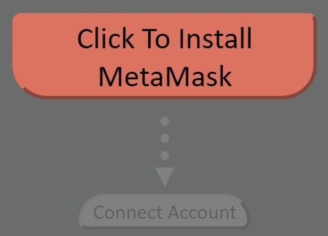

Component built by Yan Digilov 
yan@pandi.fi 
MIT Open Source License

#  REACT - METAMASK Connection Tool
This is a simple component tool to connect to a metamask wallet from the front-end of
any React.js application. 

It determines whether a user has metamask installed and takes them through the steps of establishing a connection.  Once a connection is made, it displays account information for easy access.  

#  Dependencies
It uses the following dependencies to establish a connection:
-  MetaMask Onboarding library:  https://docs.metamask.io/guide/onboarding-library.html
-  MetaMask Detect Provider: https://www.npmjs.com/package/@metamask/detect-provider

It uses the following style libraries:
-  Styled Components: https://styled-components.com/

# Searches for MetaMask Installation.
 

# Identifies connected addresses
 

# Displays active account and chain

